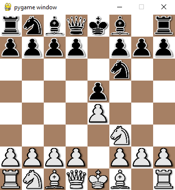

## About The Project



This is a GUI for playing chess.
It based on [pygame](https://github.com/pygame/pygame),
and [python-chess](https://github.com/niklasf/python-chess).
It's not feature-rich yet, but has all you need to play chess easily

## Installation
- Clone this repo with `git clone`
- `cd` to project folder, and install all required libraries by
```sh
$ pip install -r doc/requirements.txt
```
- Now you should be able to just run the **main.py**
